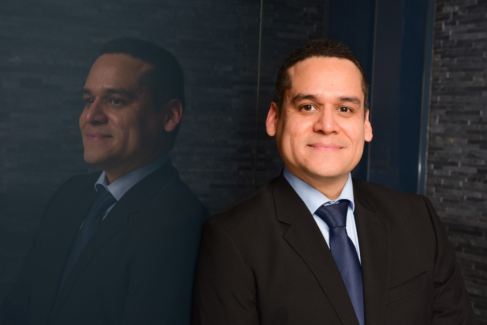

Hi, I'm Edgardo "Edo" Bermudez, a Software Engineer turned into Product Management. Explore my journey, projects, and ideas as I share my passion for the tech world and provide Product Management training/mentoring/whatever. Let's create something amazing together!

---

## About Me

I’m a [Your Profession] with a passion for tech. With 15+ years of experience in [Your Field], I specialize in [Your Skills]. When I’m not working, I enjoy [Your Hobbies].

---

## My Projects

Take a look at some of the exciting projects I’ve worked on:
- **[Project 1]**: A brief description of the project.
- **[Project 2]**: Another project description.
- **[Project 3]**: Highlight something unique.

[View All Projects →](projects/)

---

## Blog

I write about [topics you write about]. Check out my latest posts:
- **[Post Title 1]**: A short description of the post.
- **[Post Title 2]**: Another post description.
- **[Post Title 3]**: Highlight something interesting.

[Read the Blog →](blog/)

---

## Get in Touch

I’d love to hear from you! Whether you have a question, want to collaborate, or just want to say hi, feel free to reach out.

[Contact Me →](contact/)
